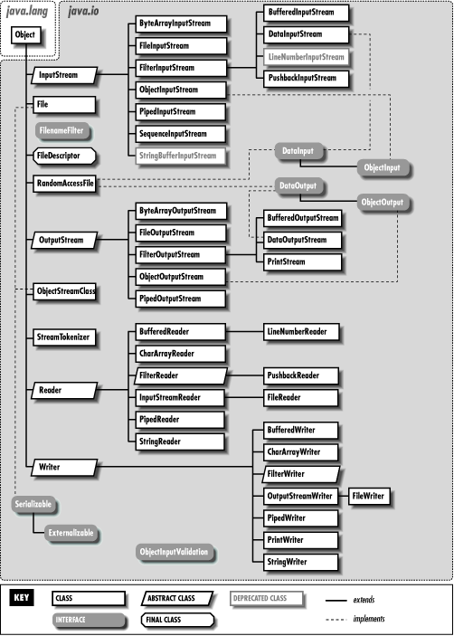

# Entrada e Saída de Arquivos (I/O) em Java

## Exercícios

- Teclado --[Stream Entrada]-> Aplicação --[Stream Saída] -> Console;
- Fluxo `System.in` para abrir o teclado;
- Classe `InputStreamReader` para transformar fluxo System em fluxo character;
- `BufferedReader` para melhorar manipulação dos dados de entrada;
- Fluxo `System.out` para imprimir no console;
- `OutputStreamWriter` para transformar o fluxo do `System.in` em bytes;
- `BufferedWriter` para melhorar a manipulação dos dados de saída;

- Teclado --[Stream Entrada]-> Aplicação --[Stream Saída] -> Arquivo.txt;
- Classe `Scanner` para abrir o teclado;
- Classe `File` para controle do arquivo;
- Classe `FileWriter` para criação e escrita do arquivo "rec.txt";
- `BufferedWriter` para melhorar escrita dos characters;
- Padrão Decorator para simplificação;
- `PrintWriter` para escrever mensagem no console;

- Arquivo1.txt --[Stream Entrada]-> Aplicação --[Stream Saída] -> Arquivo2.txt;
- Teclado --[Stream Entrada]-> Aplicação --[Stream Saída] -> Arquivo2.txt;

## Java.io

> Provides for system input and output through data streams, serialization and the file system. Unless otherwise noted, passing a null argument to a constructor or method in any class or interface in this package will cause a NullPointerException to be thrown.

- **Pipe Streams**: Permitem a comunicação entre *threads* em um mesmo programa (ou JVM). Eles são usados para transferir dados de saída de um thread para a entrada de outro.
- **Filter Streams**: Adicionam funcionalidades a um stream existente.
- **Data Streams**: Suportam I/O binário de valores de tipos (int, double, sort, etc.) de dados.
- **Buffered Streams**: Utilizam técnicas de melhoramentos de performance para reduzir a sobrecarga de I/O não bufferizado



### Byte-Based

- `InputStream` implements `Closeable` (): This abstract class is the superclass of all classes representing an **input stream of bytes**.
  - `FilterInputStream` extends `InputStream` (InputStream in): A FilterInputStream contains some other input stream, which it uses as its basic source of data.
    - `BufferedInputStream` extends `FilterInputStream` (InputStream in, [int size]): A BufferedInputStream adds functionality to another input stream-namely, the ability to **buffer the input and to support the mark and reset methods**.
    - `DataInputStream` extends `FilterInputStream` implements `DataInput` (InputStream in): A data input stream lets an application **read primitive Java data types** from an underlying input stream in a machine-independent way. An application uses a data output stream to write data that can later be read by a data input stream.
  - `FileInputStream` extends `InputStream` (File file | FileDescriptor fdObj | String name): A FileInputStream obtains **input bytes from a file** in a file system. What files are available depends on the host environment. FileInputStream is meant for **reading streams of raw bytes such as image data**. For reading streams of characters, consider using FileReader.
  - `ObjectInputStream`:

```java
BufferedInputStream bis = new BufferedInputStream(new FileInputStream(f.getName()));
DataInputStream dis = new DataInputStream(new FileInputStream(f.getPath()));
```

- `OutputStream` implements `Closeable`, `Flushable` (): This abstract class is the superclass of all classes representing an **output stream of bytes**. An output stream accepts output bytes and sends them to some sink.
  - `FilterOutputStream` extends `OutputStream` (OutputStream out): This class is the superclass of all classes that filter output streams.
    - `BufferedOutputStream` extends `FilterOutputStream` (OutputStream out, [int size]): The class implements a buffered output stream. By setting up such an output stream, an **application can write bytes to the underlying output stream without necessarily causing a call to the underlying system for each byte written**.
    - `DataOutputStream` extends `FilterOutputStream` implements `DataOutput` (OutputStream out): A data output stream lets an application **write primitive Java data types to an output stream** in a portable way. An application can then use a data input stream to read the data back in.
    - `PrintStream` extends `FilterOutputStream` implements `Appendable`, `Closeable` (...): A PrintStream adds functionality to another output stream, namely the ability to **print representations of various data values conveniently**. All characters printed by a PrintStream are converted into bytes using the platform's default character encoding.
  - `FileOutputStream` extends `OutputStream` ([File file | String name], [boolean append] | FileDescriptor fdObj): A file output stream is an **output stream for writing data to a File or to a FileDescriptor**. Whether or not a file is available or may be created depends upon the underlying platform.

```java
BufferedOutputStream bos = new BufferedOutputStream(new FileOutputStream(nomeArquivoCopy));
DataOutputStream dos = new DataOutputStream(new FileOutputStream(f.getPath()));
```

### Character-Based

- `Reader` implements `Readable`, `Closeable` ([Object lock]): Abstract class for **reading character streams**. The only methods that a subclass must implement are read(char[], int, int) and close().
  - `BufferedReader` extends `Reader` (Reader in, [int sz]): Reads text from a **character-input stream**, buffering characters so as to provide for the efficient reading of characters, arrays, and lines.
  - `InputStreamReader` extends `Reader`(InputStream in, [Charset cs | CharsetDecoder dec | String charsetName]): An InputStreamReader is a bridge from **byte streams to character streams**: It reads bytes and decodes them into characters using a specified charset. The charset that it uses may be specified by name or may be given explicitly, or the platform's default charset may be accepted.
    - `FileReader` extends `InputStreamReader` (File file | FileDescriptor fd | String fileName): Convenience class for **reading character files**. The constructors of this class assume that the default character encoding and the default byte-buffer size are appropriate. To specify these values yourself, construct an InputStreamReader on a FileInputStream.

```java
BufferedReader br = new BufferedReader(new InputStreamReader(System.in));
BufferedReader br = new BufferedReader(new FileReader(fileName));
```

- `Writer` implements `Appendable`, `Closeable`, `Flushable` ([Object lock]): Abstract class for writing to character streams. The only methods that a subclass must implement are write(char[], int, int), flush(), and close().
  - `BufferedWriter` extends `Writer` (Writer out, [int sz]): Writes text to a **character-output stream**, buffering characters so as to provide for the efficient writing of single characters, arrays, and strings.
  - `OutputStreamWriter` extends `Writer` (OutputStream out, [Charset cs | CharsetDecoder dec | String charsetName]): An OutputStreamWriter is a bridge from **character streams to byte stream**s: Characters written to it are encoded into bytes using a specified charset. The charset that it uses may be specified by name or may be given explicitly, or the platform's default charset may be accepted.
    - `FileWriter` extends `OutputStreamWriter` (File file, [boolean append]) | (FileDescriptior fd) | (String fileName, [boolean append]): Convenience class for **writing character files**. The constructors of this class assume that the default character encoding and the default byte-buffer size are acceptable. To specify these values yourself, construct an OutputStreamWriter on a FileOutputStream.

```java
BufferedWriter bw = new BufferedWriter(new OutputStreamWriter(System.out));
BufferedWriter bw = new BufferedWriter(new FileWriter(f.getName()));
BufferedWriter bw = new BufferedWriter(new FileWriter(arquivo, true));

PrintWriter pw = new PrintWriter(System.out);
```

### Outros

- `File` implements `Serializable`, `Comparable<File>`: An abstract representation of file and directory pathnames.
- `System.in`: The "standard" input stream. This stream is already open and ready to supply input data. Typically this stream corresponds to keyboard input or another input source specified by the host environment or user.
- `System.out`: The "standard" output stream. This stream is already open and ready to accept output data. Typically this stream corresponds to display output or another output destination specified by the host environment or user.
