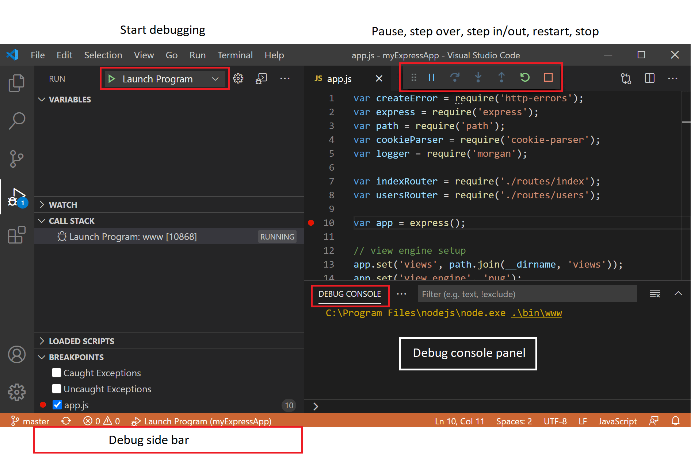
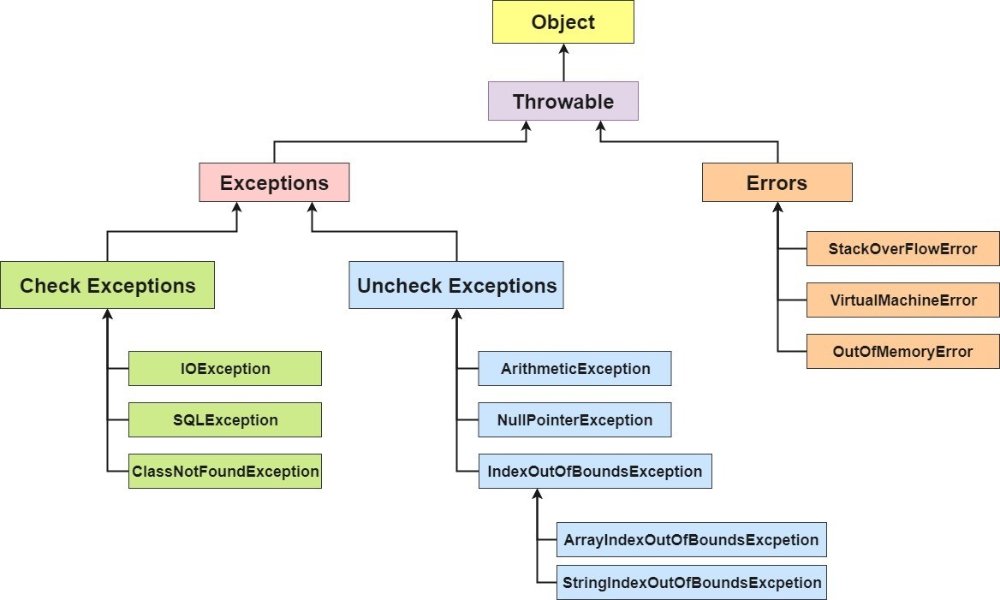
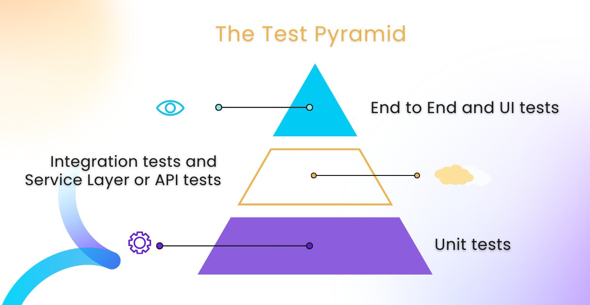

# Qualidade de Código e Boas Práticas com Java

## Debugging Java

**Debuggin**/**Depuração**: Processo de encontrar e corrigir *bugs*.

- Erros de Sintaxe: Erro nas regras estabelecidas na linguagem (símbolos, palavras-chaves, estruturas, etc.);
- Erros de Semântica: Erro na lógica do código;

Os depuradores funcionam assumindo o controle do tempo de execução de um programa, permitindo observação e controle. Ele mostra a pilha do programa e permite avanço ou retrocesso.

### VSCode




- `Continue/Pause` (F5): Continuar execução normal do programa/script até o próximo ponto de interrupção.
- `Step Over` (F10): Executar o próximo método como um comando único.
- `Step Into` (F11): Entrar no próximo método para acompanhar sua execução linha por linha.
- `Step Out` (Shift+F11): Sair de um método ou subrotina.
- `Restart` (Ctrl+Shift+F5): Finalizar execução atual e recomeçar o debug.
- `Stop` (Shift+F5): Finalizar execução;


## Tratamento de Exceções

**Exception** é um evento que interrompe o fluxo normal do processamento de uma classe. O tratamento de exceções torna o programa mais robusto e confiável, e permite continuar a execução de um programa depois de ildar com um problema.



- **Error**: Usado pela JVM que serve para indicar se existe algum problema de recurso do programa, tornando a execução impossível de continuar.
- **Unchecked Exception** (Runtime): Exceptions que podem ser evitados se forem tratados e analisados pelo desenvolvedor. São erros irrecuperávies, não podem ser corrigidos durante a execução do programa.
  - Ocorrem em tempo de execução;
  - O compilador não verifica essas exceções;
  - Não precisam de tratamento explicito;
- **Checked Exception**: Exceptions que devem ser evitados e tratados pelo desenvolvedor.
  - Ocorrem em tempo de compilação;
  - O compilador verifica;
  - Tratamento obrigatório utilizando `try-catch` (e `finally`) e/ou `throws`/`throw`.

## Entrada e Saída de Arquivos (I/O) em Java

- Arquivo na visão do Sistema Operacional é um depósito de dados persistentes, um conjunto de bytes.
- File Streams podem ser *byte-based* (binary, char = 2bytes, int = 4 bytes, etc.), gerando binary files ou *character-based* (sequência de caracteres de 2 bytes), gerando text files.
- Arquivo na visão do Java é uma Stream, um fluxo sequencial de bytes.
  - Input Stream: Data Source -> Stream (0 & 1) -> Program;
  - Output Stream: Data Destination -> Stream (0 & 1) -> Program;
  - Forma geral Read/Write:
    1. Abrir a Stream
    1. while() {read/write}
    1. Fechar a Stream
- Cada arquivo acaba com um marcador de fim.

Um programa Java abre um arquivo cirando um objeto e associando a ele um stream (bytes or characters). O construtor do objeto interage como o sistema operacional e abre o arquivo. Três *stream objects* são associados aos dispositivos.

- System.in (standard input stream object): Habilita o programa a receber bytes do teclado;
- System.out (standardd output stream object): Normalmente habilita o programa a exibir character data à tela;
- System.err (standard error stream object): Normalmente habilita o programa a exibir mensagens de erro character-based;

A classe `System` permite redirecionar essas streams pelos métodos `setIn`, `setOut` e `setErr`.

O pacote `java.io` e `java.nio` auxiliam o processamento baseado em stream com classes e interfaces.

- **Serialização**: Resume-se em salvar, gravar, capturar o estado de um objeto.

## SOLID

Auxilia o programador a escrever códigos mais limpos, facilitando a refatoração e estimulando o reaproveitamento do código.

- **Single Responsibility Principle**: *A class should have one and only one reason to change, meaning that a class should have only one job.*
  - A classe deve possuir uma única responsabilidade dentro do software.
- **Open Closed Principle**: *Objects or entities should be open for extension but closed for modification.*
  - Objetos abertos para extensão, fechados para modificação;
  - Novos comportamentos são respondidos com estensão do código fonte original.
- **Liskov Substitution Principle**: *Let q(x) be a property provable about objects of x of type T. Then q(y) should be provable for objects y of type S where S is a subtype of T.*
  - Classes derivadas devem ser substituíveis por suas classes base.
  - Se para cada objeto **O1** do **Tipo S** há um objeto **O2** do **Tipo T** de forma que, para todos os **Programas P**, o comportamento de **P** é inalterado quando **O1** é substituído por **O2**, então **S é subtipo de T**.
- **Interface Segragation Principle**: *A client should never be forced to implement an interface that it doesn’t use, or clients shouldn’t be forced to depend on methods they do not use.*
  - Uma classe não deve ser forçada a implementar interfaces e métodos que não serão utilizados.
  - É melhor criar interfaces mais específicas ao invés de termos uma única interface genérica.
- **Dependency Inversion Principle**: *Entities must depend on abstractions, not on concretions. It states that the high-level module must not depend on the low-level module, but they should depend on abstractions.*
  - Um módulo de alto nível não deve depender de módulos de baixo nível, ambos devem depender da abstração.

## Introdução a Testes de Software

### Conceitos

- **Defeito**: Qualquer imperfeição ou inconsistência no produto de software ou em seu processo. Também é considerado uma não conformidade.
  - O defeito faz parte do produto e está implementado no código de maneira errada.
- **Erro**: Resultado de um defeito ou de uma falha, como o retorno de um valor indesejado.
- **Falha**: Resultado de um erro, geralmente no hardware ou sistema.
- **Verificação**: Processo de avaliar se o software foi construído corretamente. Envolve revisões, inspeções e análises estáticas para identificar defeitos antes da execução do código.
- **Validação**: Avaliação se o software atende à demanda que o fez necessário em primeiro lugar. Verifica se o produto está de acordo com as especificações determinadas e funciona corretamente.

### Níveis

1. **Unidade**:
    - Os testes de unidade verificam se partes individuais do código (como funções, métodos ou classes) funcionam corretamente.
    - Eles são executados isoladamente e geralmente automatizados.
    - O objetivo é garantir que cada unidade de código esteja correta e atenda às especificações.
2. **Integração**
    - Os testes de integração verificam a interação entre diferentes partes do sistema.
    - Eles garantem que os componentes se comuniquem corretamente e que a integração funcione conforme o esperado.
    - Exemplos incluem testes de API, testes de banco de dados e testes de serviços.
3. **Sistema**
    - Os testes de sistema avaliam todo o sistema como uma unidade.
    - Eles verificam se o software atende aos requisitos funcionais e não funcionais.
    - Testes de desempenho, segurança e usabilidade também fazem parte dessa categoria.
4. **Regressão**
    - Os testes de regressão são executados para garantir que as alterações recentes no código não afetem funcionalidades existentes.
    - Eles ajudam a evitar que defeitos sejam reintroduzidos após correções ou atualizações.
5. **Aceitação**
    - Os testes de aceitação são realizados para verificar se o software atende aos critérios de aceitação definidos pelo cliente ou usuário final.
    - Eles validam se o sistema está pronto para ser entregue e usado em produção.

- **Alpha**: O teste Alpha permite verificar a funcionalidade e o desempenho do produto em um ambiente controlado antes do lançamento oficial.
  - Ele visa descobrir possíveis falhas ou problemas em recursos individuais e fluxos de trabalho do usuário, garantindo que sejam corrigidos antes do lançamento.
  - Além disso, o teste Alpha avalia a facilidade de uso do software.
- **Beta**: O teste Beta é uma versão pública de teste (PTB) para Desktop (no iOS é chamado de Testflight e no Android é chamado de Beta).
  - Essa versão geralmente possui mais bugs do que a versão estável, mas não deve prejudicar o uso normal.
  - Os usuários podem testar novos recursos e fornecer feedback antes do lançamento oficial.
- **Cannary**: O canal Canary recebe todas as versões mais recentes (incluindo a estável).
  - Isso significa que você pode testar todos os recursos assim que forem construídos.
  - As atualizações são geralmente lançadas semanalmente e são usadas principalmente para mostrar os recursos mais recentes e avançados.

### Técnicas

- **Caixa Branca**: Teste Estrutural.
  - Validar dados, controles, fluxos, chamadas;
  - Garantir a qualidade da implementação;
  - Níveis: Unidade, Integração, Regressão;
- **Caixa Preta**: Teste Funcional.
  - Verificar saídas usando vários tipos de entrada;
  - Teste sem conhecer a estrutura interna do software;
  - Níveis: Integração, Sistema, Aceitação;
- **Caixa Cinza**: Mescla de técnicas.
  - Analisa parte lógica e também funcionalidade;
  - Ter acesso a documentação do funcionamento do código;
  - Engenharia Reversa;

### Testes Não Funcionais

Testes não funcionais estão ligados aos requisitos não funcionais, como:

- Comportamento do Sistema;
- Performance;
- Escalabilidade;
- Segurança;
- Infraestrutura;

O **teste de carga** é realizado para verificar qual o volume de transações, acessos simultâneos e/ou usuários que um servidor/software/sistema suporta.

O **teste de stress** é realizado para submeter o software a situações extremas, testando seus limites e avaliando seu comportamento e falhas.

O **teste de segurança** é um processo crítico que visa detectar vulnerabilidades em sistemas, software, redes e aplicativo.

### Pirâmide de Testes



1. Testes Unitários:
    - Os testes de unidade são realizados na menor parte testável de uma aplicação, independentemente de sua interação com outras partes do código.
    - Esses testes focam em unidades individuais, como métodos ou funções específicas.
    - São rápidos de criar e executar, pois testam pequenos pedaços isolados do código.
    - A criação de objetos “falsos” (conhecidos como test doubles) permite testar unidades de forma isolada.
    - Os testes de unidade também podem guiar a escrita do código, especialmente quando usados no desenvolvimento orientado a testes (TDD).
    - Esses testes servem como uma rede de segurança durante refatorações e ajudam a dar contexto.
2. Testes de Integração:
    - Os testes de integração verificam a interação entre diferentes partes do sistema.
    - Eles garantem que os componentes se comuniquem corretamente e que a integração funcione conforme o esperado.
    - Exemplos incluem testes de API (testando endpoints e fluxos de dados) e testes de serviços.
    - Esses testes são mais lentos que os de unidade, mas ainda são essenciais para garantir a qualidade do sistema.
3. Testes Ponta a Ponta:
    - Os testes ponta a ponta (E2E) simulam a interação do usuário com o sistema.
    - Eles verificam fluxos completos, desde a interface do usuário até o banco de dados.
    - São mais lentos e complexos, pois envolvem toda a pilha tecnológica.
    - Exemplos incluem testes de UI automatizados, onde cenários reais são simulados.
    - Embora essenciais, esses testes devem ser usados com moderação devido à sua complexidade e tempo de execução.

## Testes Unitários Com JUnit

- Framework open source para criação de testes unitários;
- Criado por Erich Gamma (Design Patterns) e Kent Beck (TDD);

- JUnit 5:
  - **JUnit Platform**: base para a execução de testes no ecossistema JUnit. Ele fornece uma infraestrutura comum para rodar testes em diferentes engines (motores de teste).
  - **JUnit Jupiter**: combina o modelo de programação e o modelo de extensão para escrever testes e extensões.
  - **JUnit Vintage**: usado para executar testes escritos em versões mais antigas do JUnit, como o JUnit 3 e o JUnit 4.

- `Assertions`: Classe responsável por fornecer métodos estáticos verificar se os resultados esperados de um teste correspondem aos resultados reais obtidos durante a execução do teste.
  - Para tratar com execções, usa-se os métodos `.assertThrows` ou `.assertDoesNotThrow`.

  ```java
    @Test //Marcação de Teste
    void deveCalcularIdadeCorretamente() {
        Pessoa jessica = new Pessoa("Jéssica", LocalDateTime.of(2000, 1, 1, 15, 0, 0)); // Cenário
        Assertions.assertEquals(22, jessica.getIdade()); // Execução de Validação
    }
  ```

- `Assumptions`: Classe responsável para avaliar se um teste deve prosseguir ou ser abortado.
  - Se uma assumption não for atendida, o teste não falha, mas é interrompido e marcado como ignorado.
- `@BeforeAll` / `@AfterAll`: Método deve ser executado uma única vez antes/após todos os outros.
- `@BeforeEach` / `@AfterEach`: Método deve ser executado vez antes/após  cada outro método.
- **Testes Condicionais** são uma maneira poderosa de controlar a execução dos testes com base em determinadas condições.
  - `@EnabledOnOs(OS._)` e `@DisabledOnOs(OS._)`: Controlam a execução do teste com base no sistema operacional.
  - `@EnabledOnJre(JRE._)` e `@DisabledOnJre(JRE._)`: Permitem a execução de testes em versões específicas do Java Runtime Environment (JRE).
  - `@EnabledIfEnvironmentVariable()` e `@DisabledIfEnvironmentVariable()`: Habilitam ou desabilitam testes com base no valor de variáveis de ambiente.
  - `@EnabledIfSystemProperty()` e `@DisabledIfSystemProperty()`:  Similar às variáveis de ambiente, mas para propriedades do sistema.
  - `@EnabledIf()` e `@DisabledIf()`: Executam ou não os testes com base no resultado de expressões personalizadas.
- Ordenar testes:
  - `@TestMethodOrder` é uma anotação de nível de classe que é usada para configurar um `MethodOrderer` para os métodos de teste da classe de teste anotada.

  ```java
  @TestMethodOrder(MethodOrderer.OrderAnnotation.class)
  class OrderedTests {
      @Test
      @Order(1)
      void primeiroTeste() {}

      @Test
      @Order(2)
      void segundoTeste() {}

      @Test
      @Order(3)
      void terceiroTeste() {}
  }  
  ```

  - @DisplayName` é uma anotação que pode ser usada tanto em classes quanto em métodos de teste para declarar um nome de exibição personalizado.

  ```java
  @TestMethodOrder(MethodOrderer.DisplayName.class)
  class OrderedTests {
      @DisplayName("A: Algo")
      @Test
      void primeiroTeste() {}

      @DisplayName("B: Bom")
      @Test
      void segundoTeste() {}

      @DisplayName("C: Conclusão")
      @Test
      void terceiroTeste() {}
  }  
  ```

### Gradle

```groovy
testImplementation(platform("org.junit:junit-bom:5.10.2"))
testRuntimeOnly("org.junit.platform:junit-platform-launcher") {
  because("Only needed to run tests in a version of IntelliJ IDEA that bundles older versions")
}
testRuntimeOnly("org.junit.jupiter:junit-jupiter-engine")
testRuntimeOnly("org.junit.vintage:junit-vintage-engine")
```

### Maven

```xml
<!-- ... -->
<dependencies>
    <!-- Only needed to run tests in a version of IntelliJ IDEA that bundles older versions -->
    <dependency>
        <groupId>org.junit.platform</groupId>
        <artifactId>junit-platform-launcher</artifactId>
        <scope>test</scope>
    </dependency>
    <dependency>
        <groupId>org.junit.jupiter</groupId>
        <artifactId>junit-jupiter-engine</artifactId>
        <scope>test</scope>
    </dependency>
    <dependency>
        <groupId>org.junit.vintage</groupId>
        <artifactId>junit-vintage-engine</artifactId>
        <scope>test</scope>
    </dependency>
</dependencies>
<dependencyManagement>
    <dependencies>
        <dependency>
            <groupId>org.junit</groupId>
            <artifactId>junit-bom</artifactId>
            <version>5.10.2</version>
            <type>pom</type>
            <scope>import</scope>
        </dependency>
    </dependencies>
</dependencyManagement>
```
